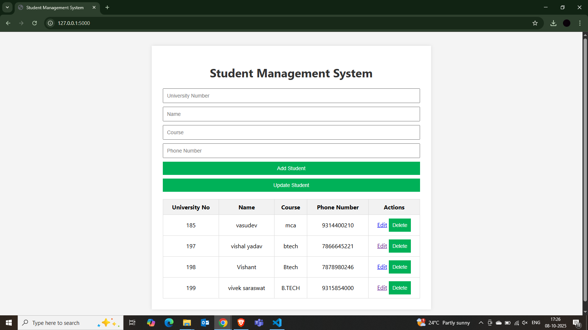

# Student Management System

The **Student Management System** is a robust web application designed for efficient management of student records. Built using **Flask** and **MySQL**, this system streamlines the process of adding, updating, viewing, and deleting student information through a user-friendly web interface.

## Overview

This application is ideal for educational institutions seeking a reliable solution to handle student data securely and efficiently. The intuitive interface ensures ease of use for administrators and staff, while the backend guarantees data integrity and performance.

## Key Features

- **Add Students:** Seamlessly register new students by entering their university number, name, course, and contact details.
- **View Records:** Access a comprehensive, searchable table displaying all student records for quick reference.
- **Update Information:** Modify existing student details directly from the interface, ensuring records remain current.
- **Delete Records:** Remove student entries as required, maintaining an up-to-date database.
- **Secure Backend:** Utilizes Flask to provide a secure and scalable API and web server.
- **Reliable Database:** Integrates with MySQL for robust data storage and management, using `pymysql` for connectivity.

## Technology Stack

- **Backend:** Python (Flask)
- **Database:** MySQL
- **Frontend:** HTML, CSS
- **Database Connector:** pymysql

## User Interface

Below is a screenshot of the application's user interface:

<!-- Insert UI screenshot here -->
![Student Management System UI]

---

This project demonstrates best practices in web development, database integration, and user experience design for educational management systems.
